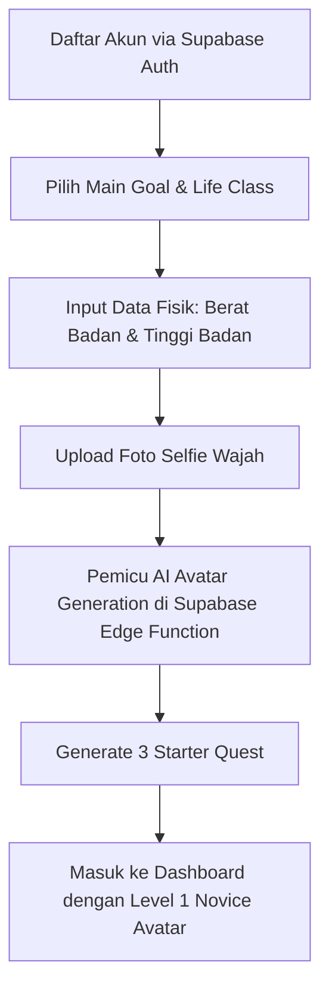

# Dokumen Desain & Alur — Level Zero (Gamified Self-Development App)

Dokumen ini disusun berdasarkan Business Requirements Document (BRD), Product Requirements Document (PRD), dan User Story yang ada untuk menyepakati keputusan desain arsitektur, database, alur game loop, dan detail implementasi aplikasi iOS Native **Level Zero**.

---

## 1. Arsitektur & Pilihan Teknologi (Tech Stack)
*Status: Disepakati*

*   **Platform**: iOS Native App (untuk pengujian langsung di iPhone fisik milik user).
*   **Frontend Framework**: **SwiftUI** (UI deklaratif modern yang memungkinkan pembuatan animasi fluida dan antarmuka bertema game RPG yang kaya visual).
*   **Styling (UI Theme)**: **Dark-RPG / Cyberpunk Theme** (Warna dasar gelap/hitam pekat dengan aksen gradasi neon blue/purple, glowing borders, font kustom bergaya game, dan pemanfaatan SF Symbols untuk ikonografi).
*   **Backend & Database**: **Supabase** (PostgreSQL database, Supabase Auth, dan Real-time API).
*   **Authentication**: Supabase Auth (Email/Password & Google Sign-In).
*   **File Storage (untuk Proof)**: **Supabase Storage** (Bucket khusus untuk menyimpan foto/screenshot bukti quest).
*   **AI Engine / Logic**: Rule-based engine (untuk rilis MVP) dengan opsi integrasi OpenAI API di masa depan untuk AI Quest Generator.
*   **Testing & Deployment**: **Xcode Direct USB Deployment** (untuk testing langsung di iPhone fisik user) & **TestFlight** jika ingin didistribusikan ke tester lain.

---

## 2. Desain Database (Schema)
*Status: Disepakati*

Menggunakan PostgreSQL di Supabase dengan skema relasional berikut:

```sql
-- 1. PROFILES (Extends Supabase auth.users)
CREATE TABLE public.profiles (
    id UUID PRIMARY KEY REFERENCES auth.users(id) ON DELETE CASCADE,
    username TEXT UNIQUE NOT NULL,
    life_class TEXT CHECK (life_class IN ('warrior', 'scholar', 'builder', 'monk', 'strategist')) NOT NULL,
    level INTEGER DEFAULT 1 NOT NULL,
    xp INTEGER DEFAULT 0 NOT NULL,
    rank TEXT DEFAULT 'E' CHECK (rank IN ('E', 'D', 'C', 'B', 'A', 'S')) NOT NULL,
    intensity TEXT DEFAULT 'normal' CHECK (intensity IN ('easy', 'normal', 'hard')) NOT NULL,
    
    -- AI Avatar & Physical Data
    original_selfie_url TEXT, -- Link ke foto asli user di Supabase Storage
    avatar_url TEXT, -- Link ke foto avatar hasil olahan AI
    weight NUMERIC, -- Berat badan awal (kg)
    height NUMERIC, -- Tinggi badan (cm)
    target_weight NUMERIC, -- Target berat badan (opsional)
    
    -- Character Stats
    strength INTEGER DEFAULT 10 NOT NULL,
    intelligence INTEGER DEFAULT 10 NOT NULL,
    discipline INTEGER DEFAULT 10 NOT NULL,
    charisma INTEGER DEFAULT 10 NOT NULL,
    wealth INTEGER DEFAULT 10 NOT NULL,
    mind INTEGER DEFAULT 10 NOT NULL,
    
    created_at TIMESTAMP WITH TIME ZONE DEFAULT TIMEZONE('utc'::text, NOW()) NOT NULL
);

-- 2. QUESTS (Master Data Quest Pool)
CREATE TABLE public.quests (
    id UUID PRIMARY KEY DEFAULT gen_random_uuid(),
    title TEXT NOT NULL,
    description TEXT NOT NULL,
    difficulty TEXT CHECK (difficulty IN ('E', 'D', 'C', 'B', 'A', 'S')) NOT NULL,
    stat_reward TEXT NOT NULL, -- e.g., 'strength', 'intelligence', etc.
    xp_reward INTEGER NOT NULL,
    is_proof_required BOOLEAN DEFAULT FALSE NOT NULL,
    life_class TEXT CHECK (life_class IN ('warrior', 'scholar', 'builder', 'monk', 'strategist')), -- Nullable jika general
    created_at TIMESTAMP WITH TIME ZONE DEFAULT TIMEZONE('utc'::text, NOW()) NOT NULL
);

-- 3. USER_QUESTS (Relasi harian quest per user)
CREATE TABLE public.user_quests (
    id UUID PRIMARY KEY DEFAULT gen_random_uuid(),
    user_id UUID REFERENCES public.profiles(id) ON DELETE CASCADE NOT NULL,
    quest_id UUID REFERENCES public.quests(id) ON DELETE SET NULL, -- Null jika custom quest
    custom_title TEXT, -- Terisi jika user membuat custom quest
    custom_description TEXT,
    status TEXT DEFAULT 'active' CHECK (status IN ('active', 'completed', 'skipped')) NOT NULL,
    skip_reason TEXT,
    assigned_date DATE DEFAULT CURRENT_DATE NOT NULL,
    completed_at TIMESTAMP WITH TIME ZONE,
    xp_earned INTEGER DEFAULT 0 NOT NULL,
    stat_earned TEXT -- Menyimpan nama stat yang dinaikkan (e.g. 'strength')
);

-- 4. WEEKLY_BOSSES (Master Data Boss Challenge)
CREATE TABLE public.weekly_bosses (
    id UUID PRIMARY KEY DEFAULT gen_random_uuid(),
    title TEXT NOT NULL,
    description TEXT NOT NULL,
    xp_reward INTEGER NOT NULL,
    stat_rewards JSONB NOT NULL, -- e.g., {"discipline": 5, "intelligence": 5}
    badge_reward TEXT, -- Nama file badge / icon reward
    life_class TEXT CHECK (life_class IN ('warrior', 'scholar', 'builder', 'monk', 'strategist'))
);

-- 5. USER_WEEKLY_BOSSES (Status tantangan boss mingguan user)
CREATE TABLE public.user_weekly_bosses (
    id UUID PRIMARY KEY DEFAULT gen_random_uuid(),
    user_id UUID REFERENCES public.profiles(id) ON DELETE CASCADE NOT NULL,
    boss_id UUID REFERENCES public.weekly_bosses(id) ON DELETE CASCADE NOT NULL,
    week_start_date DATE NOT NULL,
    status TEXT DEFAULT 'active' CHECK (status IN ('active', 'completed', 'failed')) NOT NULL,
    completed_at TIMESTAMP WITH TIME ZONE
);

-- 6. PROOF_SUBMISSIONS (Bukti penyelesaian quest)
CREATE TABLE public.proof_submissions (
    id UUID PRIMARY KEY DEFAULT gen_random_uuid(),
    user_quest_id UUID REFERENCES public.user_quests(id) ON DELETE CASCADE NOT NULL,
    proof_type TEXT CHECK (proof_type IN ('photo', 'screenshot', 'text_note', 'link')) NOT NULL,
    proof_url TEXT NOT NULL, -- URL ke Supabase Storage bucket
    created_at TIMESTAMP WITH TIME ZONE DEFAULT TIMEZONE('utc'::text, NOW()) NOT NULL
);

-- 7. BOOKS (Daftar Buku Master yang Disediakan)
CREATE TABLE public.books (
    id UUID PRIMARY KEY DEFAULT gen_random_uuid(),
    title TEXT NOT NULL,
    author TEXT NOT NULL,
    cover_url TEXT, -- Link ke storage untuk cover buku
    content_url TEXT NOT NULL, -- Path file JSON/EPUB isi buku di Supabase Storage
    created_at TIMESTAMP WITH TIME ZONE DEFAULT TIMEZONE('utc'::text, NOW()) NOT NULL
);

-- 8. USER_READING_SESSIONS (Riwayat Sesi Membaca Buku User)
CREATE TABLE public.user_reading_sessions (
    id UUID PRIMARY KEY DEFAULT gen_random_uuid(),
    user_id UUID REFERENCES public.profiles(id) ON DELETE CASCADE NOT NULL,
    book_id UUID REFERENCES public.books(id) ON DELETE CASCADE NOT NULL,
    duration_seconds INTEGER DEFAULT 0 NOT NULL, -- Total durasi aktif membaca
    takeaway TEXT, -- Kalimat refleksi singkat dari user setelah selesai membaca
    xp_earned INTEGER DEFAULT 0 NOT NULL, -- Reward XP yang diperoleh (+25 XP)
    created_at TIMESTAMP WITH TIME ZONE DEFAULT TIMEZONE('utc'::text, NOW()) NOT NULL
);
```

---

## 3. Alur Sistem & State Machine (Core Loop)
*Status: Disepakati*

### A. Alur Onboarding (First-Time User)


### B. Alur Harian (Daily Quest Loop)
1.  **Pemicu Harian (Daily Trigger)**:
    *   Setiap hari pada pukul 00:00 waktu lokal iPhone user, aplikasi melakukan pengecekan ke database Supabase.
    *   Jika belum ada data di `user_quests` untuk tanggal hari ini (`assigned_date = CURRENT_DATE`), sistem akan menarik 3 quest dari `quests` master pool.
    *   Quest yang dipilih dicocokkan dengan `life_class` dan `intensity` pengguna.
2.  **Skema Reward XP & Stats**:
    *   Penyelesaian quest akan memberikan XP dan menaikkan stat terkait:
        *   **E-Rank (Sangat Mudah)**: 50 XP & +1 Stat
        *   **D-Rank (Mudah)**: 100 XP & +2 Stats
        *   **C-Rank (Sedang)**: 150 XP & +3 Stats
        *   **B-Rank (Sulit)**: 250 XP & +5 Stats
        *   **A-Rank (Sangat Sulit)**: 400 XP & +8 Stats
3.  **Mekanisme Level Up & Rank Up**:
    *   Setiap naik level, threshold XP dihitung dengan rumus: `XP_Next_Level = Level * 100`.
    *   Ketika total XP mencapai threshold, status `level` bertambah 1.
    *   Sistem memeriksa `level` saat ini untuk menentukan kenaikan `rank`:
        *   **E Rank**: Level 1–10
        *   **D Rank**: Level 11–20
        *   **C Rank**: Level 21–35
        *   **B Rank**: Level 36–50
        *   **A Rank**: Level 51–75
        *   **S Rank**: Level 76+
4.  **Validasi & Proof Submissions**:
    *   Jika quest ditandai selesai, status di `user_quests` menjadi `completed`.
    *   User dapat mengunggah file (foto/screenshot) melalui `proof_submissions` ke Supabase Storage. File proof bersifat opsional untuk daily quest biasa, namun memberikan bonus **+20 XP** jika diunggah.

### C. Alur Weekly Boss Challenge
1.  **Kemunculan Boss**:
    *   Setiap hari Senin pukul 00:00 waktu lokal, sistem membuat baris baru di `user_weekly_bosses` dengan mengambil data dari `weekly_bosses` master pool (mencocokkan `life_class`).
    *   Boss ini bertindak sebagai milestone mingguan (S-Rank, bernilai **1000 XP** & +15 Stats).
2.  **Mekanisme Reroll**:
    *   User diperbolehkan mengganti (reroll) Boss Challenge sebanyak **maksimal 1 kali** per minggu sebelum hari Rabu pukul 23:59.
3.  **Penyelesaian**:
    *   User harus menyelesaikan semua persyaratan boss sebelum hari Minggu pukul 23:59. Jika berhasil, user menekan tombol "Conquer Boss" di aplikasi untuk mengklaim XP dan Badge.

### D. Alur Recovery System (Anti-Burnout)
1.  **Deteksi Inaktif**:
    *   Jika user tidak membuka aplikasi atau tidak menyelesaikan quest tunggal pun selama **36 jam berturut-turut**, sistem mendeteksi status inaktif.
2.  **Konsekuensi & Penalti**:
    *   Streak harian di-reset menjadi 0. **Tidak ada penalti pengurangan XP atau level down** untuk menghindari demotivasi berlebih (anti-burnout).
3.  **Recovery Quest**:
    *   Saat user kembali login setelah inaktif, dashboard akan terkunci dan hanya menampilkan satu **Recovery Quest** ringan (Difficulty E, contoh: *"Minum air putih 1 gelas"* atau *"Lakukan peregangan 2 menit"*).
    *   Menyelesaikan Recovery Quest akan membuka kembali daily quest normal dan memberikan bonus awal **50 XP** serta memulihkan keaktifan user.

### E. Alur Pengolahan & Evolusi AI Avatar
1.  **Inisialisasi (Onboarding)**:
    *   User mengunggah foto wajah asli ke Supabase Storage (`original_selfie_url`).
    *   Aplikasi SwiftUI memicu Supabase Edge Function yang meneruskan foto tersebut ke AI Image Generation API (seperti Replicate SDXL / InstantID).
    *   **AI Prompt (Full-Body & Standing Pose)**: *"A full-body standing portrait of an RPG game character, level 1 novice adventurer, [life_class] style, matching facial features of [original_selfie], simple gear, standing pose, cyberpunk neon highlights, dark background, 8k resolution"*.
    *   Hasil olahan disimpan di `profiles.avatar_url` dan ditampilkan secara interaktif di Dashboard SwiftUI.
2.  **Mekanisme Interaktivitas Avatar (SwiftUI)**:
    *   **Tap to Speak**: Jika user melakukan tap pada tubuh avatar di layar, avatar akan memunculkan bubble chat text berisi pesan motivasi acak atau saran latihan yang disesuaikan dengan status stat terlemah user saat ini.
    *   **Gyroscope Parallax Effect**: Menggunakan sensor gyroscope iPhone (`CoreMotion` framework) untuk menggeser sudut pandang gambar full-body avatar dan bingkainya secara 3D (parallax effect) saat iPhone dimiringkan.
    *   **Dynamic Particles Background**: Latar belakang avatar dirender dengan partikel SwiftUI dinamis yang menyala (contoh: partikel bara api untuk Warrior, baris kode digital untuk Builder, hembusan angin tenang untuk Monk) yang bergerak lebih cepat seiring dengan tingginya level user.
3.  **Evolusi & Pertumbuhan Fisik Berdasarkan Stats (Rank-Up Trigger)**:
    *   Ketika user naik Rank (E -> D -> C -> dst.), sistem memicu rendering ulang avatar baru dengan AI.
    *   **Pertumbuhan Fisik & Gear disesuaikan dengan Stat Tertinggi User**:
        *   Jika stat tertinggi adalah **Strength** (Warrior/Fisik): Tubuh avatar berevolusi menjadi lebih berotot, tegap, atletis, dan mengenakan baju pelindung berat/armor tempur besi.
        *   Jika stat tertinggi adalah **Intelligence / Mind** (Scholar/Monk): Avatar memiliki jubah mage yang bercahaya, memegang buku kuno terapung, dan memiliki aura energi biru/putih di sekeliling tubuhnya.
        *   Jika stat tertinggi adalah **Wealth / Charisma** (Strategist/Builder): Avatar mengenakan jubah kepemimpinan bergaya techno-nobility, memegang senjata/alat canggih (cyber-sword/tablet), dan latar belakang bernuansa emas neon.
    *   **Daftar Evolusi Prompt (Full-Body)**:
        *   **E-Rank (Level 1-10)**: *"A full-body standing RPG character, level 1 novice adventurer, simple leather armor, standing pose, basic background"*
        *   **D-Rank (Level 11-20)**: *"A full-body standing RPG character, level 15 warrior/scholar, iron gear, athletic body build, slight neon aura, standing pose"*
        *   **C-Rank (Level 21-35)**: *"A full-body standing RPG character, level 30 elite tier, magical chestplate or techno-robes, muscular/defined build, floating energy particles, standing pose"*
        *   **B-Rank (Level 36-50)**: *"A full-body standing RPG character, level 45 master, glowing runic armor, weapon in hand, glowing eyes, intense aura background, standing pose"*
        *   **A-Rank (Level 51-75)**: *"A full-body standing RPG character, level 65 grandmaster, legendary heavy crystal armor, levitating magical artifacts, powerful aura, standing pose"*
        *   **S-Rank (Level 76+)**: *"A full-body standing RPG character, level 99 shadow monarch style, divine glowing armor, massive neon energy wings, floating weapon, legendary aura, standing pose"*
    *   User akan melihat layar transisi dramatis di iOS (dengan animasi SwiftUI) yang me-reveal tampilan avatar barunya begitu render selesai. User juga bisa men-share card evolusi ini.

### F. Sistem Membaca Buku (In-App Reader & Focus Timer)
1.  **Curated Book Library**:
    *   Sistem menyediakan katalog buku (`books` table) pengembangan diri (contoh: *Atomic Habits, Deep Work, Meditations*, dll.).
    *   Buku disimpan dalam format halaman terstruktur (JSON/EPUB) di Supabase Storage untuk di-render oleh custom reader SwiftUI.
2.  **Sesi Membaca 10 Menit**:
    *   Saat user memilih buku dan mulai membaca, aplikasi masuk ke mode reading penuh (immersive e-reader) dan memicu **10-minute Focus Timer**.
    *   Target utama: Membaca secara aktif selama minimal 10 menit (600 detik).
3.  **Aturan Anti-Idle (Deteksi Keaktifan)**:
    *   SwiftUI melacak interaksi membalik halaman (*page-turn* / *scroll*).
    *   Jika sistem mendeteksi **tidak ada aktivitas membalik halaman dalam waktu 3 menit (180 detik)**, timer otomatis dijeda (paused) dan muncul notifikasi *"Are you still reading?"*.
    *   Timer akan berjalan kembali setelah ada aktivitas membaca (sentuhan layar / page turn).
4.  **Klaim XP via Refleksi Akhir**:
    *   Setelah timer 10 menit selesai, tombol *"Absorb Wisdom"* aktif.
    *   User wajib menuliskan minimal 1 kalimat refleksi atau poin penting (*takeaway*) dari apa yang baru dibaca di form input modal.
    *   Setelah disubmit, data disimpan ke `user_reading_sessions`, dan user menerima **+25 XP** (berkontribusi langsung untuk peningkatan stat **Intelligence** atau **Mind**).

---

## 4. Struktur Antarmuka & Navigasi (UI/UX)
*Status: Disepakati*

Aplikasi menggunakan **Dark-RPG / Cyberpunk Theme** dengan warna dasar gelap pekat, aksen neon (cyan, purple, blue), font bertema game, dan efek glowing.

### Struktur Navigasi (iOS TabView)
1.  **Character Dashboard (Tab 1)**:
    *   **Header**: Nama user, Level, Rank badge (desain lencana neon), dan Streak Counter (ikon api berkobar).
    *   **Interactive Full-Body Avatar Card**: Penempatan gambar berdiri utuh (full-body) karakter RPG pengguna. Dilengkapi interaksi ketukan (Tap-to-Speak) yang memunculkan ucapan motivasi, efek kemiringan 3D gyroscope parallax saat iPhone digerakkan, dan SwiftUI Particle System (bara api/matrix rain/magical aura) di latar belakang avatar.
    *   **XP Progress Bar**: Bar horizontal berkilau dengan animasi gradasi.
    *   **Stats Radar Chart**: Polygon grafik 6 sudut yang digambar kustom menggunakan SwiftUI `Path` untuk memvisualisasikan `Strength`, `Intelligence`, `Discipline`, `Charisma`, `Wealth`, dan `Mind`.
    *   **Quick Daily Quests**: Daftar 3 quest aktif hari ini bergaya kartu gulungan misi (quest scrolls).
2.  **Quest Board (Tab 2)**:
    *   Halaman detail daftar quest harian, mingguan, dan riwayat aktivitas.
    *   Fitur "Create Custom Quest" (untuk menambahkan quest mandiri).
    *   Aksi penyelesaian quest menggunakan gesture **Swipe-to-Complete** yang memicu haptic feedback dinamis pada iPhone.
3.  **Library & In-App Reader (Tab 3)**:
    *   **Katalog Buku**: Grid horizontal dari cover buku yang tersedia (berkategori self-improvement).
    *   **Focus Reading Screen**: Saat buku dipilih, halaman masuk ke layar e-reader minimalis dengan warna latar hangat (sepia/gelap), floating timer 10 menit di sudut atas, dan page-indicator.
    *   **Reflection Pop-up**: Modal overlay yang muncul ketika timer 10 menit habis, menanyakan *"What did you learn today?"* dengan form input teks untuk menuliskan *takeaway* dan mengklaim XP.
4.  **Boss Raid Room (Tab 4)**:
    *   Halaman khusus pertarungan Boss mingguan.
    *   Menampilkan visual boss misterius dengan HP Bar yang berkurang seiring user mencentang checklist misi boss.
    *   Countdown timer sisa waktu menyerang boss (hingga hari Minggu pukul 23:59).
5.  **Trophy Room & Profile Card (Tab 5)**:
    *   Tempat memajang lencana/badge hasil mengalahkan Boss mingguan.
    *   Tombol "Generate Profile Card" yang memproses rendering view SwiftUI menjadi file Image (menggunakan `ImageRenderer` bawaan iOS 16+) untuk disimpan atau dibagikan ke media sosial.

---

## 5. Rencana Implementasi & Milestone
*Status: Disepakati*

### Fase 1: Setup Backend & Supabase (Minggu 1)
*   Inisialisasi database Supabase dengan skema tabel PostgreSQL lengkap (`profiles`, `quests`, `user_quests`, `books`, `user_reading_sessions`, dsb).
*   Setup Supabase Auth, Storage bucket untuk proof, selfie, dan data buku, serta API keys.
*   Setup kerangka project Xcode menggunakan target iOS 16+.

### Fase 2: Onboarding & Integrasi AI Generator (Minggu 2)
*   Pembuatan form onboarding SwiftUI (pilihan goal, class, input berat/tinggi badan).
*   Integrasi iOS Camera / Photo Library picker untuk upload foto selfie wajah.
*   Implementasi Supabase Edge Function untuk integrasi ke AI Image API (Replicate / DALL-E) untuk men-generate base avatar level 1.

### Fase 3: Dashboard, Library Slicing & Custom UI (Minggu 3)
*   Slicing layout Character Dashboard & Grid Katalog Buku di SwiftUI.
*   Pembuatan custom SwiftUI View: **Stat Radar Chart** dan **Glowing XP Bar**.
*   Slicing layout e-reader interface (layout halaman baca buku).
*   Penerapan tema visual gelap dengan efek gradasi neon dan haptic feedback.

### Fase 4: Core Loop, Reading Timer & Recovery (Minggu 4)
*   Sinkronisasi real-time status quest harian ke Supabase.
*   Implementasi **Focus Timer 10 Menit** dan **deteksi keaktifan membalik halaman (anti-idle)** di custom e-reader.
*   Pembuatan modal input refleksi akhir membaca dan integrasinya ke tabel `user_reading_sessions`.
*   Implementasi logic check-in harian (reset streak jika > 36 jam inaktif) dan UI **Recovery Quest**.

### Fase 5: Weekly Boss, Trophy Room, & Testing (Minggu 5)
*   Implementasi halaman Boss Raid Room dan logic HP Bar Boss.
*   Fitur rendering Profile Card menggunakan `ImageRenderer` SwiftUI.
*   Pengujian langsung menggunakan iPhone fisik via Xcode USB Deployment, dilanjutkan distribusi beta via TestFlight.
