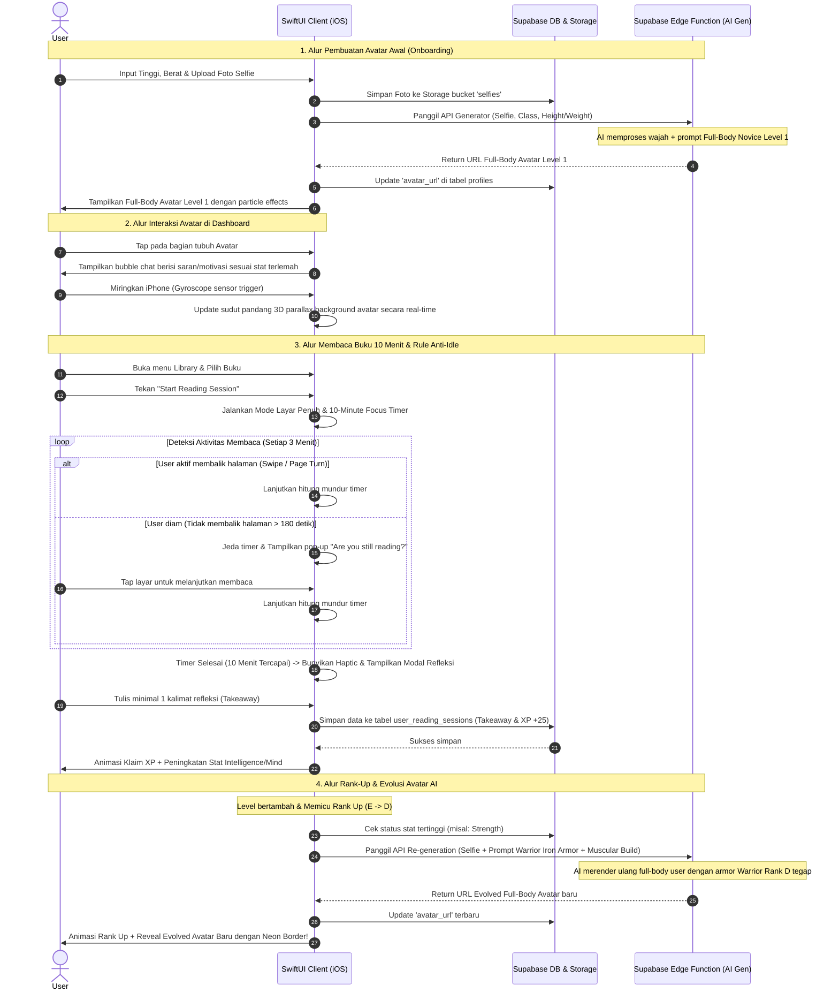

# Wireframe, Mockup, & Prototype Desain — Level Zero iOS

Dokumen ini menjelaskan struktur visual (wireframe), panduan desain (mockup), dan alur interaksi (prototype) untuk aplikasi iOS Native **Level Zero** menggunakan SwiftUI.

---

## 1. Panduan Desain Visual (Mockup Guidelines)

Aplikasi ini menggunakan tema **Dark-RPG / Cyberpunk** yang intens dan imersif, dirancang untuk memberikan *"main character energy"* kepada pengguna.

### A. Palet Warna (Cyberpunk Neon Palette)
*   **Background Utama**: `#0B0C10` (Deep Space Black - Hitam Pekat)
*   **Card / Containers**: `#1F2833` (Dark Slate Grey - Abu-abu gelap)
*   **Warna Aksen 1 (Primary/Level/Misi)**: `#66FCF1` (Neon Cyan - Biru muda berpendar)
*   **Warna Aksen 2 (Boss/Rank S)**: `#8A2BE2` (Purple Glow - Ungu pekat neon)
*   **Warna Aksen 3 (Streak/Warning)**: `#FFD700` (Gold Flame - Kuning emas api)
*   **Teks Utama**: `#FFFFFF` (Solid White)
*   **Teks Sekunder**: `#C5C6C7` (Light Ash Grey)

### B. Tipografi (Typography)
*   **Title/Header Misi/Level**: Font bertema gaming/futuristik (contoh: *Outfit* atau *Impact* dengan efek tracking agak lebar).
*   **Teks Deskripsi/Buku**: Font serif/sans-serif bersih (*Inter* atau *Georgia* untuk mode baca buku) agar tidak melelahkan mata saat dibaca 10 menit.

### C. Efek & Ornamen UI
*   **Neon Outer Glow**: Batas kartu (borders) memiliki efek blur pendaran neon (cyan atau purple) yang intensitasnya disesuaikan dengan difficulty quest/rank.
*   **Glassmorphism**: Beberapa popup modal menggunakan efek blur latar belakang (*SwiftUI Material Blur*) untuk memberikan kesan kedalaman layar.
*   **Haptic Feedback**: Getaran taktil yang presisi saat membalik halaman buku, menyelesaikan quest (*success haptic*), atau gagal/inaktif.

---

## 2. Wireframe Struktur Layar (Layouts)

Berikut adalah wireframe layout halaman-halaman kunci menggunakan diagram kotak untuk menggambarkan tata letak elemen di layar iPhone.

### Layar 1: Onboarding & Selfie Upload (Layout)
```text
+------------------------------------------+
|  [Back]                           (1/4)  |
|                                          |
|            CREATE YOUR AVATAR            |
|       "Upload your face to begin"        |
|                                          |
|                 +------+                 |
|                 | Selfie|                 |
|                 | Camera|                 |
|                 |  Icon |                 |
|                 +------+                 |
|             [ Upload Photo ]             |
|                                          |
|  Physical Info:                          |
|  [ Height (cm) ]      [ Weight (kg) ]    |
|                                          |
|  Life Class Selection:                   |
|  [ Warrior ] [ Builder ] [ Scholar ]...  |
|                                          |
|                                          |
|  [           GENERATE AVATAR           ] |
+------------------------------------------+
```

### Layar 2: Character Dashboard / Status HUD (Layout)
```text
+------------------------------------------+
|  [Fire] 14 Days Streak         [Settings]|
|                                          |
|  +------------------------------------+  |
|  |           AI AVATAR CARD           |  |
|  |            (FULL-BODY)             |  |
|  |                                    |  |
|  |     [ "Keep moving forward!" ]     |  |
|  |       (Bubble chat on tap)         |  |
|  +------------------------------------+  |
|  NAME: JinWoo  |  LVL: 14  | D-Rank      |
|  CLASS: Warrior (Parallax/Particles UI)  |
|  [========== XP: 1420 / 1500 ==========] |
|                                          |
|            STAT RADAR CHART              |
|                 /\ STR                   |
|            MND /  \ INT                  |
|               |    |                     |
|            WEA \  / CHA                  |
|                 \/ DIS                   |
|                                          |
|  ACTIVE QUESTS                           |
|  +-------------------------------------+ |
|  | Quest 1: Workout 20m (Swipe to Comp)| |
|  +-------------------------------------+ |
|  | Quest 2: Focus Read 10m (Swipe to C)| |
|  +-------------------------------------+ |
+------------------------------------------+
```

### Layar 3: In-App E-Reader & Focus Timer (Layout)
```text
+------------------------------------------+
|  [Close]    ATOMIC HABITS    [Timer 09:58]|
|                                          |
|  Chapter 1: The Surprising Power of      |
|  Tiny Habits...                          |
|                                          |
|  Success is the product of daily habits— |
|  not once-in-a-lifetime transformations. |
|                                          |
|  You do not rise to the level of your    |
|  goals. You fall to the level of your    |
|  systems.                                |
|                                          |
|  An atomic habit is a little habit that  |
|  is part of a larger system.             |
|                                          |
|                                          |
|  < Prev Page                      Next > |
|  [======= Page 12 of 320 (8%) =======]   |
+------------------------------------------+
```

---

## 3. Prototype Alur Interaksi (User Flow)

Diagram di bawah ini menggambarkan alur interaksi terperinci dari proses onboarding, evolusi avatar, hingga pemicu sensor keaktifan membaca buku 10 menit.


